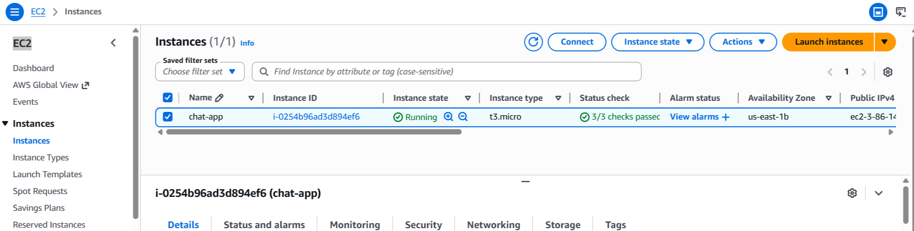
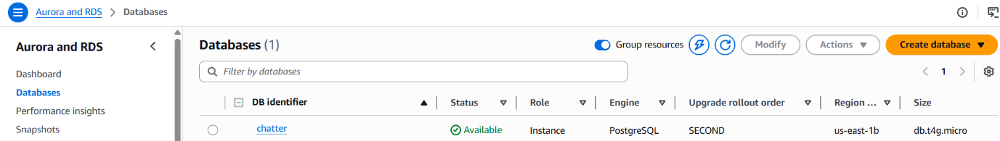
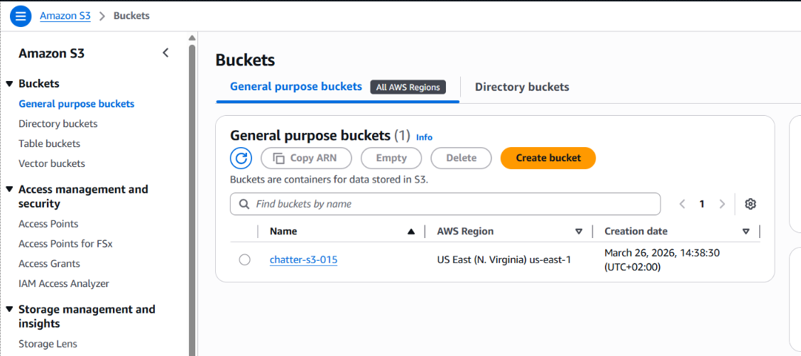

# AWS Deployment Guide

This guide walks through deploying the Real-Time Chat Application on AWS using EC2, RDS, and S3.

## Architecture Overview

| Service | Purpose |
|---------|---------|
| **EC2** | Hosts the NestJS application |
| **RDS (PostgreSQL)** | Managed database |
| **S3** | File storage (profile photos) |





---

## Prerequisites

- AWS Account with appropriate permissions
- GitHub account with Personal Access Token (PAT)
- SSH key pair for EC2 access

---

## 1. RDS Setup (PostgreSQL)

### Create RDS Instance

1. Go to **RDS Console** > **Create database**
2. Choose **PostgreSQL**
3. Select **Free tier** (or your preferred tier)
4. Configure:
   - **DB instance identifier**: `chatter`
   - **Master username**: `chatter`
   - **Master password**: (save this securely)

### Security Group Configuration

1. Edit the RDS security group
2. Add inbound rule:
   - **Type**: PostgreSQL
   - **Port**: 5432
   - **Source**: Your EC2 security group ID

### Create the Database

After EC2 is set up, connect from your EC2 instance:

```bash
# Install PostgreSQL client first
sudo dnf install -y postgresql15

# Connect to RDS
psql -h <rds-endpoint> -U chatter -d postgres
```

Then create the database:

```sql
CREATE DATABASE chatter;
\q
```

---

## 2. S3 Setup

### Create S3 Bucket

1. Go to **S3 Console** > **Create bucket**
2. Configure:
   - **Bucket name**: `your-app-uploads` (must be globally unique)
   - **Region**: Same as your EC2 (e.g., `us-east-1`)
   - **Block Public Access**: Uncheck for public read access to profile photos

### Bucket Policy (Public Read)

Add this bucket policy:

```json
{
  "Version": "2012-10-17",
  "Statement": [
    {
      "Sid": "PublicReadGetObject",
      "Effect": "Allow",
      "Principal": "*",
      "Action": "s3:GetObject",
      "Resource": "arn:aws:s3:::your-bucket-name/*"
    }
  ]
}
```

### IAM User for App Access

1. Go to **IAM Console** > **Users** > **Create user**
2. Create a user with programmatic access
3. Attach policy: `AmazonS3FullAccess` (or custom policy for your bucket)
4. Save the **Access Key ID** and **Secret Access Key**

---

## 3. EC2 Setup

### Launch EC2 Instance

1. Go to **EC2 Console** > **Launch Instance**
2. Configure:
   - **AMI**: Amazon Linux 2023
   - **Instance type**: t2.micro (free tier)
   - **Key pair**: Select or create one
   - **Security group**: Allow SSH (22) and HTTP (80)

### Connect to EC2

```bash
ssh -i your-key.pem ec2-user@<ec2-public-ip>
```

---

## 4. Quick Deployment with Script

We provide an automated deployment script that handles everything for you.

### Step 1: Create the Deployment Script

Copy the `start_template.sh` from this repo and customize it:

```bash
# On your EC2 instance
nano start.sh
```

Paste the content from `start_template.sh` and update these values:

```bash
GITHUB_USERNAME="your-github-username"
GITHUB_REPO="Real-Time-Chat-Application"
GITHUB_TOKEN="your-github-pat"  # Personal Access Token with repo access
```

### Step 2: Run the Script

```bash
chmod +x start.sh
./start.sh
```

The script will automatically:
- Update system packages
- Install Node.js 20, Git, Nginx
- Clone your repository
- Install dependencies and build
- Create a template `.env` file
- Configure Nginx as reverse proxy with WebSocket support
- Start the app with PM2
- Setup auto-restart on reboot

### Step 3: Configure Environment Variables

After the script runs, update the `.env` file with your actual values:

```bash
nano /var/www/chat-app/.env
```

```env
NODE_ENV=production
PORT=8000

# Database (RDS)
DB_NAME=chatter
DB_USERNAME=chatter
DB_PASS=your-rds-password
DB_HOST=your-rds-endpoint.us-east-1.rds.amazonaws.com
DB_PORT=5432

# JWT
JWT_SECRET=your-secure-jwt-secret

# Email (SMTP)
EMAIL_HOST=smtp.example.com
EMAIL_PORT=587
EMAIL_USERNAME=your-email
EMAIL_PASSWORD=your-email-password
EMAIL_ADMIN=admin@example.com

# Google OAuth
GOOGLE_CLIENT_ID=your-google-client-id
GOOGLE_CLIENT_PASSWORD=your-google-client-secret
GOOGLE_REDIRECT_URL=http://your-ec2-ip/auth/oauth/google

# AWS S3
AWS_REGION=us-east-1
AWS_ACCESS_KEY_ID=your-access-key-id
AWS_SECRET_ACCESS_KEY=your-secret-access-key
AWS_S3_BUCKET=your-bucket-name
```

### Step 4: Restart the App

```bash
pm2 restart chat-app
```

---

## PM2 Commands

```bash
# View logs
pm2 logs chat-app

# Restart app
pm2 restart chat-app

# Stop app
pm2 stop chat-app

# Monitor
pm2 monit

# Check status
pm2 status
```

---

## Deployment Updates

To deploy new code changes:

```bash
cd /var/www/chat-app
git pull origin main
npm install
npm run build
pm2 restart chat-app
```

Or simply re-run the script:

```bash
./start.sh
```

---

## Security Checklist

- [ ] RDS security group only allows EC2 access
- [ ] EC2 security group limits SSH to your IP
- [ ] S3 bucket policy is minimal (only public read for uploads)
- [ ] IAM user has minimal permissions
- [ ] Environment variables contain strong secrets
- [ ] GitHub PAT has minimal scopes (only repo access)
- [ ] PM2 is configured to restart on crash

---

## Troubleshooting

### Database Connection Issues

```bash
# Test connection from EC2
psql -h <rds-endpoint> -U chatter -d chatter

# Check security groups allow EC2 -> RDS
```

### Application Not Starting

```bash
# Check PM2 logs
pm2 logs chat-app

# Check environment variables
cat /var/www/chat-app/.env

# Rebuild if needed
cd /var/www/chat-app
npm run build
pm2 restart chat-app
```

### Nginx Issues

```bash
# Test nginx config
sudo nginx -t

# Check nginx status
sudo systemctl status nginx

# View nginx logs
sudo tail -f /var/log/nginx/error.log
```

### S3 Upload Issues

```bash
# Verify AWS credentials are set in .env
cat /var/www/chat-app/.env | grep AWS

# Check app logs for S3 errors
pm2 logs chat-app
```

---

