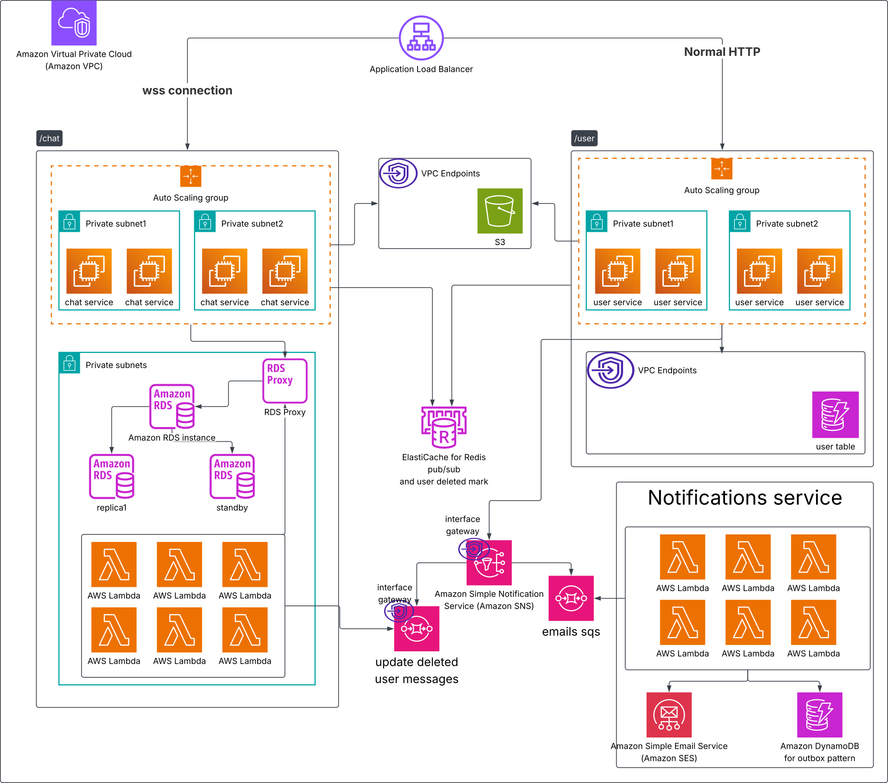

# Friend-Based Chat App — Infrastructure

A 1:1, friend-gated chat application on AWS: signup/login, friend requests, real-time
messaging over WebSockets, and account deletion with cascading cleanup — all defined
as modular Terraform.

## Services

| Service | Responsibility | Data store |
|---|---|---|
| **user-service** | Signup, login, delete account | DynamoDB (`users` table) |
| **chat-service** | Friend requests, friendships, real-time messaging (WebSocket) | RDS Postgres |
| **notifications-lambda** | Welcome / goodbye emails | DynamoDB (idempotency table) + Brevo API |
| **message-deletion-lambda** | Marks a deleted user's messages as deleted | RDS Postgres |

---

## Architecture diagram




## Why these decisions, in the order they came up

### 1. JWT validation isn't ALB's job
ALB's native "Authenticate" action is OIDC/Cognito-based, built for browser login
redirects with cookies — not for validating a bearer `Authorization: Bearer <jwt>`
header on API calls. ALB only does L7 routing here; every service validates its own
tokens.

### 2. Signature validity ≠ business validity
A JWT can be cryptographically valid and still belong to a deleted user. Two options
were considered:
- Short-lived access tokens + revocable refresh tokens (the general-purpose fix)
- **A Redis-backed revoked-user flag**, checked on every request after signature
  verification — chosen because it fits a chat app's need for *near-instant* kickout,
  and Redis was already in the stack for pub/sub.

### 3. Pub/sub was rejected for revocation, kept for chat delivery
Pub/sub is fire-and-forget: a chat-service instance that's mid-restart or
autoscaling permanently misses any event published while it was down. That's
unacceptable for something security-sensitive (a missed "user deleted" event means
a deleted user's requests keep passing).

Pub/sub is still the right tool for **broadcasting live chat messages** across
chat-service instances — a missed delivery there is a UX blip, not a security hole.
Revocation instead reads from **Redis directly, per-request** (`SISMEMBER`/`GET`),
which is centralized and instance-count-independent.

### 4. SQS over pub/sub for the deletion side-effects
SQS is a persistent queue (at-least-once delivery, survives consumer downtime),
unlike pub/sub. Deletion side effects (email, marking messages deleted) go through
SQS so a redeploying consumer catches up instead of silently missing the event.

### 5. Redis revocation write is synchronous, not event-driven
Originally the revoke flag was set by a chat-service consumer reading an SQS
message — but SQS delivery has no time guarantee, so a user could still send
messages for however long that message took to arrive. **Fix:** user-service writes
`revoked:user:<id>` to Redis **synchronously**, inside the delete request itself,
before returning to the caller. The async SQS path is now for side effects only
(email, message cleanup), not for anything security-critical.

### 6. SNS fan-out, not one queue shared by two consumers
An SQS queue delivers each message to **one consumer total**, not once per
subscriber type. Two independent consumers (email, message-deletion) need two
separate SQS queues, each subscribed to the SNS topic with its own **filter
policy** (`user.created`+`user.deleted` → email queue; `user.deleted` only →
message-deletion queue). This is the standard "one event, multiple independent
side effects" pattern — and it's simpler than it sounds because filter policies do
the routing, not application code.

### 7. DynamoDB for `users`, Postgres for chat data
DynamoDB single-table design fits access patterns that are simple and fixed
(get/put by `userId`). Chat data isn't that: friend requests have state
transitions, friendships need a uniqueness constraint, and querying "all messages
in a conversation" vs. "all messages by a deleted user" are two very different
shapes. That's a relational problem — Postgres, not a DynamoDB GSI workaround.

### 8. `chats` table was dropped
Since messaging is strictly 1:1 and gated by friendship, a friendship *is* the
chat — `messages.friendship_id` references `friends.id` directly. A separate
`chats` table would just duplicate the same relationship. (Trade-off: if
chat-level metadata like "muted" or "archived" is ever needed, that's the reason
to reintroduce it.)

### 9. `message-deletion-lambda` is VPC-attached; `notifications-lambda` is not
Reaching RDS (private, inside the VPC) requires the Lambda to have a private IP —
that's what `vpc_config` + a dedicated ENI gets you. `notifications-lambda` only
talks to DynamoDB, SSM, and Brevo's public HTTPS API, all reachable without VPC
attachment, so it stays outside the VPC (faster cold starts, simpler IAM, no NAT
dependency).

Important nuance: even though `message-deletion-lambda` is VPC-attached, its
**SQS trigger still works fully privately** — event source mapping polling happens
on AWS's own Lambda infrastructure, outside the function's VPC ENIs, before your
code runs. VPC attachment only affects what the *function code* can reach at
runtime (RDS, in this case), not how it receives its trigger.

### 10. RDS access path for the Lambda: no NAT, no endpoint — just the ENI
VPC-to-VPC traffic (Lambda ENI → RDS, same VPC) is plain security-group-gated
routing. NAT Gateways and VPC Endpoints are both mechanisms for reaching services
*outside* the VPC (the internet, or AWS's public API endpoints) — neither applies
to a same-VPC Lambda-to-RDS call.

### 11. Interface Endpoints considered and mostly rejected
- **SNS Interface Endpoint**: not used. Once the only thing needing outbound
  internet from a private subnet is `user-service → SNS`, a single NAT Gateway
  already covers it — an Interface Endpoint would be a second, always-billed path
  to the same destination. (Documented as the "more secure, no public egress"
  option — see the toggle note below.)
- **SQS Interface Endpoint** for the Lambda: not needed at all, for the reason in
  #9 — the SQS *trigger* never touches the Lambda's VPC networking.

### 12. `freetier` toggle — considered, then dropped for simplicity
A boolean variable was designed to conditionally add: NAT Gateway vs. SNS
Interface Endpoint (mutually exclusive), 1 vs. 2 NAT Gateways, RDS
Multi-AZ+replica+proxy vs. single instance. **This build ships the free-tier path
only** (single NAT Gateway, single RDS instance, no proxy) to keep the module set
readable. The production-grade alternatives are documented here rather than
implemented, and are a natural next step if the toggle is reintroduced later.

### 13. Why one shared NAT Gateway, not one per AZ
A NAT Gateway is AZ-scoped. One shared NAT Gateway means private subnets in other
AZs route to it across an AZ boundary — a real availability trade-off (if that
AZ has an outage, every private subnet loses outbound access, not just its own).
Accepted here deliberately for cost; 1-per-AZ is the production fix.

### 14. RDS: single instance, but the DB subnet group still spans 2 AZs
AWS requires a DB subnet group to span 2+ AZs even for a non-Multi-AZ instance —
this isn't a Multi-AZ setup, it's a resource-eligibility requirement. The instance
itself only ever runs in one AZ.

### 15. Email: SES considered, then Brevo
SES's free tier is tied to sending from EC2 within an AWS account and isn't a
flat "free for everyone" allowance — since this project runs through Lambda (not
EC2-hosted mail), Brevo was chosen instead as a straightforwardly free
transactional-email provider. The API key is **not** an environment variable in
plaintext — it's stored in **SSM Parameter Store as a `SecureString`** (KMS
encrypted, IAM-gated `ssm:GetParameter`), which was picked over Secrets Manager
specifically for the free-tier constraint (no per-secret monthly charge).

### 16. Idempotency
- **`notifications-lambda`**: DynamoDB conditional `PutItem`
  (`attribute_not_exists(eventKey)`) before sending — SQS's at-least-once
  delivery means the same "send welcome email" message can arrive twice; the
  conditional put makes the second arrival a no-op. TTL on the idempotency
  record avoids unbounded table growth.
- **`message-deletion-lambda`**: naturally idempotent — `UPDATE ... SET
  is_deleted = true WHERE is_deleted = false` produces the same end state no
  matter how many times it runs.

### 17. Batching the email Lambda
`batch_size = 10` + `maximum_batching_window_in_seconds = 30` groups multiple SQS
messages into a single invocation instead of firing per-message — appropriate
because email sending isn't latency-sensitive. `ReportBatchItemFailures` is used
on both Lambdas so a single bad message in a batch doesn't force a full-batch
redelivery of otherwise-successful items.

### 18. IAM vs. security groups — two different jobs
Every module keeps this distinction explicit: **security groups gate the network
path** (who can open a TCP connection to whom); **IAM gates the AWS API
permission** (what actions are allowed once connected). RDS and Redis access is
entirely security-group + credential based — no IAM policy exists for either,
because neither is a native AWS API Lambda/EC2 call.

---

## Module map

```
modules/
├── network/              VPC, subnets, 1 NAT Gateway, S3 + DynamoDB Gateway Endpoints
├── security-groups/      Every SG, chained: ALB → services → Redis / RDS
├── alb/                  ALB, path-based routing, sticky sessions for chat-service
├── data-s3/               Shared bucket (profile-photos/, message-media/ prefixes)
├── data-dynamodb/         users table, notifications-idempotency table
├── data-redis/            Single-node ElastiCache, no cluster mode
├── data-rds/               Single Postgres instance, 2-AZ DB subnet group
├── messaging/             SNS topic, 2 SQS queues + DLQs, filter-policy subscriptions
├── compute-user-service/  ASG + launch template + scoped IAM role
├── compute-chat-service/  ASG + launch template + scoped IAM role
└── lambda/
    ├── notifications/     Not VPC-attached; SSM param, DynamoDB, Brevo
    └── message-deletion/  VPC-attached; reaches RDS over the private network
```

## What's deliberately out of scope here

- CloudWatch alarms/dashboards (explicitly excluded — Lambda execution logs still
  land in CloudWatch Logs automatically regardless, since that's not optional)
- CI/CD pipeline
- RDS Proxy, Multi-AZ, read replica (documented as the non-free-tier path, not built)
